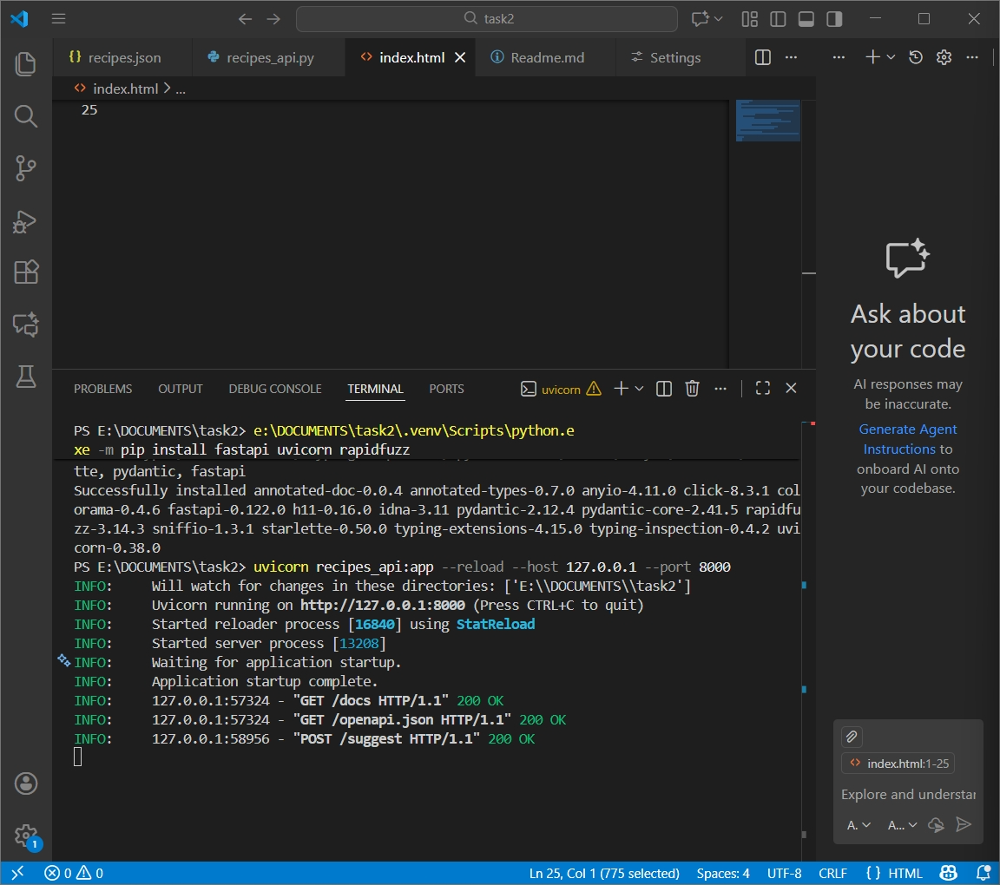
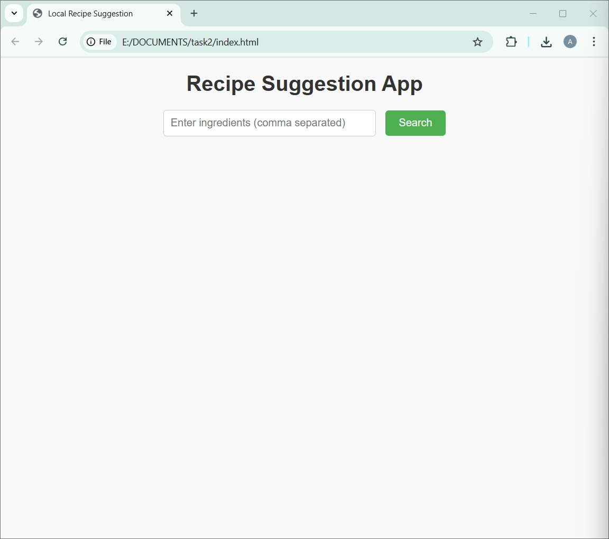
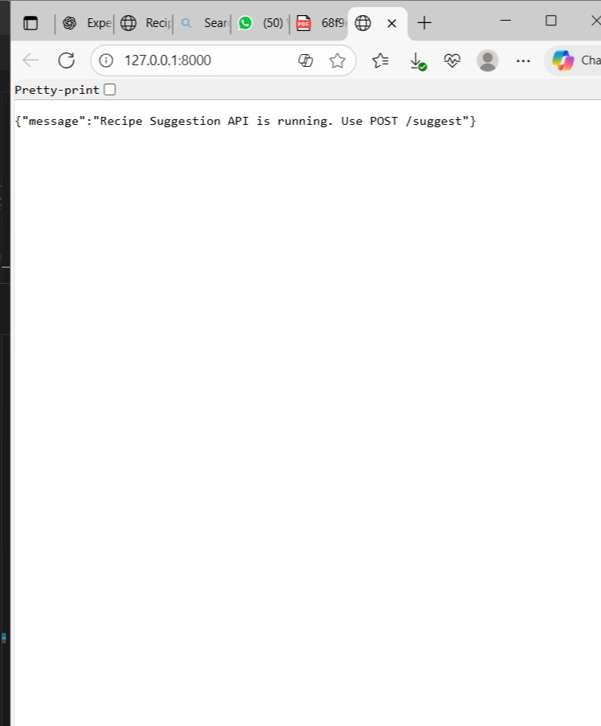
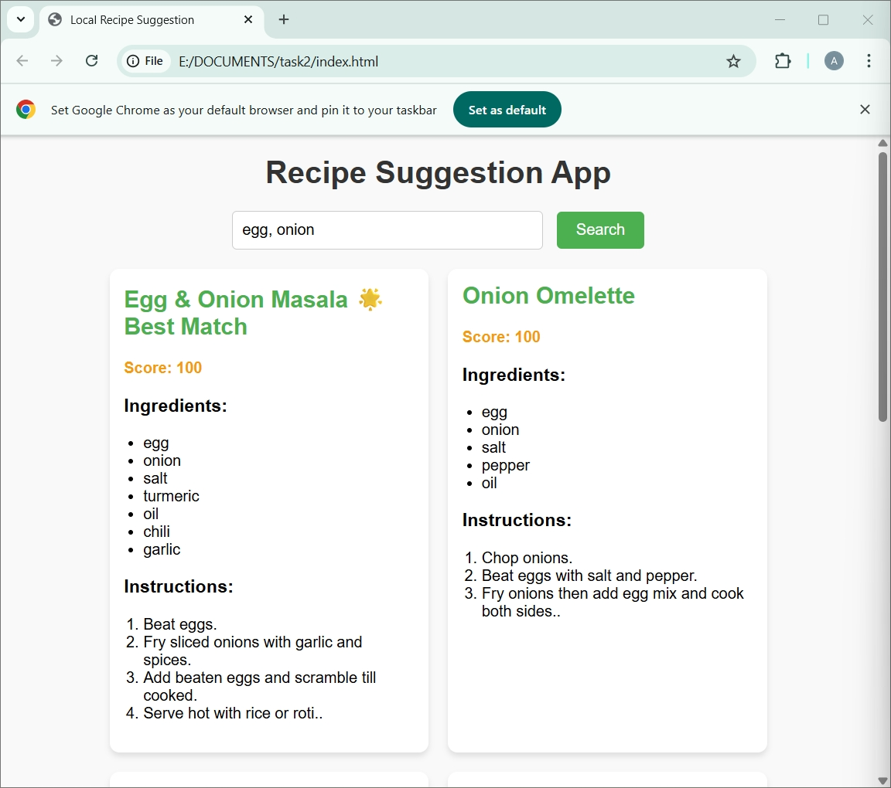
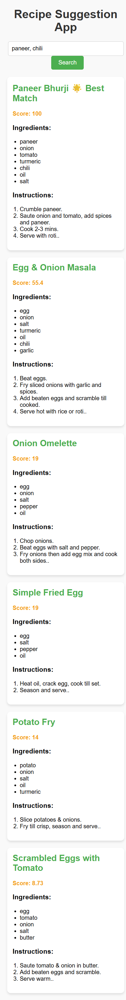

Recipe Suggestion App
Project Overview

This project is a local recipe suggestion system built using Python, FastAPI, and a simple HTML frontend.

It has two main components:

Backend API: A FastAPI server that takes ingredients as input and returns a list of recipes ranked by similarity.

Frontend UI: An HTML interface to enter ingredients and display recipes in a readable format.

The system allows users to input ingredients they have, and it suggests the best matching recipes along with a ranked list of other recipes.

Project Structure
project-folder/
│
├── recipes_api.py          # FastAPI backend server
├── recipes.json            # Recipe dataset
├── index.html              # Frontend UI
├── README.md               # This file
├── requirements.txt        # Optional: List of dependencies
└── result/                # Folder for screenshots
    ├── image1.png
    ├── image2.png
    └── ...

Setup Instructions
1. Prerequisites

Python 3.8 or above installed

pip package manager installed

 Local testing instructions 

python recipes_api.py

uvicorn recipes_api:app --reload

2. Install Dependencies

Open a terminal and run:

pip install fastapi uvicorn

If you have other packages in your code, add them here (e.g., pip install requests).

3. Run the Backend Server

In the terminal, navigate to the project folder and run:

python recipes_api.py

You should see output similar to:

INFO: Uvicorn running on http://127.0.0.1:8000
INFO: Application startup complete.

4. Open the Frontend

Open index.html in a web browser (Chrome recommended).

Enter ingredients (comma-separated) into the input box, e.g.:

egg, onion

Click Search. The best match recipe and other ranked recipes will be displayed as cards with:

Recipe title

Match score

Ingredients

Instructions

5. Testing the API Directly (Optional)

You can test the /suggest endpoint via the Swagger UI:

Open: http://127.0.0.1:8000/docs in a browser

Click POST /suggest

Enter request body, e.g.:

{
  "ingredients": ["egg", "onion"]
}

Execute to see the JSON response.

Sample Input & Output

Input:

egg, onion

Output:

Best Match:

Title: Egg & Onion Masala

Score: 100

Ingredients: egg, onion, salt, turmeric, oil, chili, garlic

Instructions: Beat eggs. Fry sliced onions with garlic and spices. Add beaten eggs and scramble till cooked. Serve hot with rice or roti.

Other Ranked Matches:

Onion Omelette, Score: 100

Scrambled Eggs with Tomato, Score: 100

Simple Fried Egg, Score: 59

Paneer Bhurji, Score: 55

Potato Fry, Score: 54

Screenshots

Place screenshots in the result/ folder as image1.png, image2.png, etc. Screenshots should include:

Server Running

Terminal showing Uvicorn running on http://127.0.0.1:8000

Swagger UI

/suggest endpoint with example input and JSON output

Frontend Input UI

index.html opened in browser, showing the ingredient input box and search button

Recipe Search Result

Example search (e.g., egg, onion) with best match and ranked recipes displayed

Optional Multiple Searches

One or two additional searches to show functionality

## Screenshots

### Terminal Running

### Frontend UI

### Swagger UI

### Search Result: Egg, Onion

### Search Result: Onion, Potato

Notes

Ingredients in recipes.json should be lowercase and singular for accurate matching.

The score represents the percentage of input ingredients matched with the recipe.

The project runs fully locally; no external API or database is required.